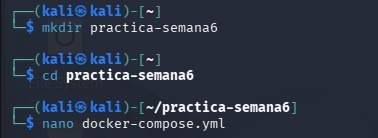
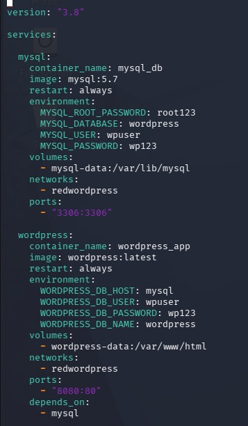
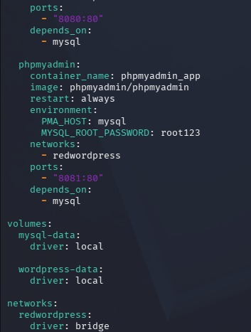
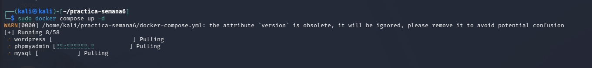
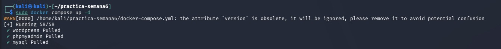
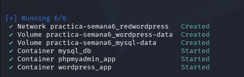
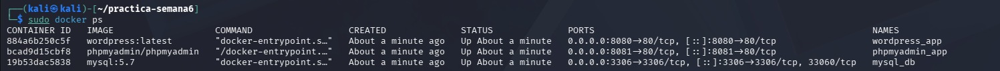
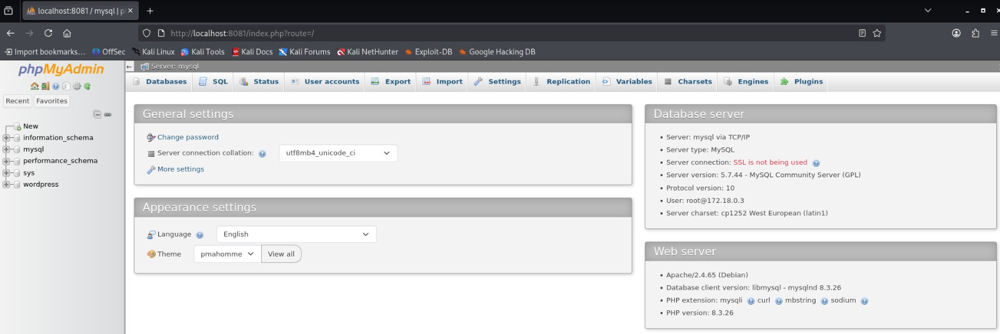
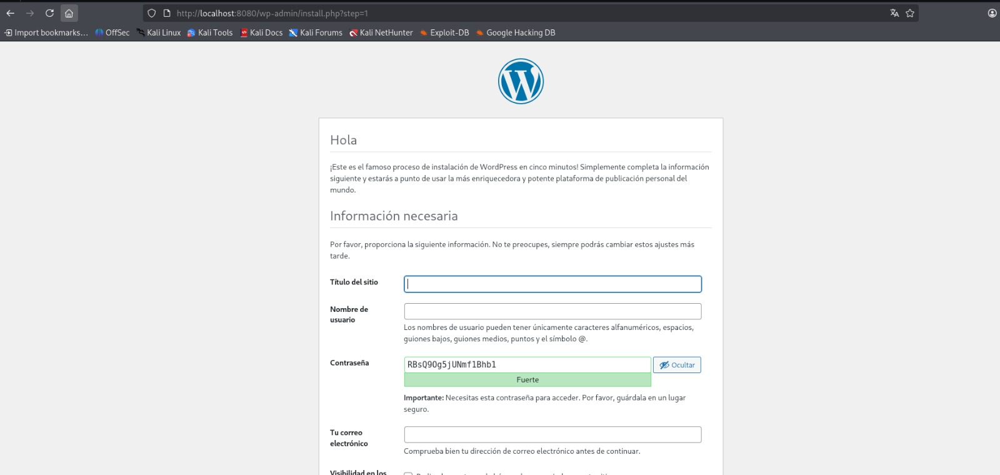

# Práctica: WordPress con Docker Compose, MySQL y phpMyAdmin

## Implementación de contenedores Docker utilizando Docker Compose y archivo YML

### Duración
120 minutos

---

# Fundamentos

Docker es una plataforma que permite crear, ejecutar y administrar contenedores. Los contenedores son entornos aislados que incluyen todas las dependencias necesarias para que una aplicación funcione correctamente, evitando conflictos entre sistemas operativos y configuraciones locales.

En esta práctica se utilizó el archivo `docker-compose.yml`, el cual permitió configurar múltiples servicios dentro de un solo entorno automatizado.

Los servicios implementados fueron:

- WordPress — Sistema de gestión de contenidos utilizado para la creación de sitios web.
- MySQL — Sistema gestor de bases de datos relacional utilizado para almacenar la información del sitio WordPress.
- phpMyAdmin — Herramienta web para administrar bases de datos MySQL mediante una interfaz gráfica.
- Red personalizada Docker — Permite la comunicación entre contenedores utilizando nombres de servicio.
- Volúmenes Docker — Utilizados para mantener la persistencia de datos aunque los contenedores sean eliminados.

---

# Conocimientos previos requeridos

- Comandos básicos de Linux
- Uso básico de Docker
- Manejo de terminal
- Conceptos básicos de redes
- Bases de datos relacionales
- Archivos YML y Docker Compose

---

# Objetivos

✅ Implementar un entorno WordPress usando Docker Compose  
✅ Implementar un contenedor MySQL  
✅ Implementar un contenedor phpMyAdmin  
✅ Configurar una red personalizada Docker  
✅ Configurar volúmenes para persistencia de datos  
✅ Establecer comunicación entre contenedores  
✅ Administrar bases de datos desde phpMyAdmin  

---

# Equipo necesario

| Recurso | Detalle |
|---|---|
| Sistema operativo | Linux Kali |
| Software | Docker y Docker Compose |
| Editor | Nano |
| Interfaz | Navegador web |
| Conectividad | Acceso a internet |

---

# Material de apoyo

- Docker Documentation: https://docs.docker.com/
- Docker Compose Documentation: https://docs.docker.com/compose/
- Docker Hub: https://hub.docker.com/
- WordPress Official Documentation: https://wordpress.org/documentation/
- MySQL Documentation: https://dev.mysql.com/doc/
- phpMyAdmin Documentation: https://www.phpmyadmin.net/docs/

---

# Procedimiento

## Paso 1 — Crear la carpeta del proyecto

Se creó una carpeta llamada `practica-semana6` para almacenar el archivo de configuración YML y los archivos de la práctica.

```bash
mkdir practica-semana6
cd practica-semana6
```

**Figura 1-1.** Creación de la carpeta del proyecto.



---

## Paso 2 — Crear el archivo docker-compose.yml

Se creó el archivo de configuración utilizando el editor Nano.

```bash
nano docker-compose.yml
```

**Figura 1-2.** Creación del archivo docker-compose.yml.



---

## Paso 3 — Configurar los servicios dentro del archivo YML

Dentro del archivo se configuraron los servicios de WordPress, MySQL y phpMyAdmin, además de los volúmenes y la red personalizada.

```yaml
services:

  mysql:
    container_name: mysql_db
    image: mysql:5.7
    restart: always
    environment:
      MYSQL_ROOT_PASSWORD: root123
      MYSQL_DATABASE: wordpress
      MYSQL_USER: wpuser
      MYSQL_PASSWORD: wp123
    volumes:
      - mysql-data:/var/lib/mysql
    networks:
      - redwordpress
    ports:
      - "3306:3306"

  wordpress:
    container_name: wordpress_app
    image: wordpress:latest
    restart: always
    environment:
      WORDPRESS_DB_HOST: mysql
      WORDPRESS_DB_USER: wpuser
      WORDPRESS_DB_PASSWORD: wp123
      WORDPRESS_DB_NAME: wordpress
    volumes:
      - wordpress-data:/var/www/html
    networks:
      - redwordpress
    ports:
      - "8080:80"
    depends_on:
      - mysql

  phpmyadmin:
    container_name: phpmyadmin_app
    image: phpmyadmin/phpmyadmin
    restart: always
    environment:
      PMA_HOST: mysql
      MYSQL_ROOT_PASSWORD: root123
    networks:
      - redwordpress
    ports:
      - "8081:80"
    depends_on:
      - mysql

volumes:
  mysql-data:
    driver: local

  wordpress-data:
    driver: local

networks:
  redwordpress:
    driver: bridge
```

**Figura 1-3.** Configuración inicial de los servicios dentro del archivo YML.



**Figura 1-4.** Continuación de la configuración del archivo docker-compose.yml.



---

## Paso 4 — Descargar imágenes y crear contenedores

Se ejecutó Docker Compose para descargar las imágenes necesarias y crear automáticamente los contenedores.

```bash
sudo docker compose up -d
```

**Figura 1-5.** Descarga de imágenes y creación de contenedores.



---

## Paso 5 — Creación de volúmenes y red personalizada

Durante la ejecución también se crearon automáticamente los volúmenes para persistencia de datos y la red Docker personalizada.

**Figura 1-6.** Creación de volúmenes y red Docker.



---

## Paso 6 — Verificar los contenedores creados

Se verificó el funcionamiento de los contenedores utilizando el comando:

```bash
sudo docker ps
```

Los servicios WordPress, MySQL y phpMyAdmin se ejecutaron correctamente.

**Figura 1-7.** Verificación de contenedores con Docker PS.



---

## Paso 7 — Acceso a phpMyAdmin

Se accedió desde el navegador web a phpMyAdmin utilizando:

```text
http://localhost:8081
```

Credenciales:

| Campo | Valor |
|---|---|
| Servidor | mysql |
| Usuario | root |
| Contraseña | root123 |

**Figura 1-8.** Acceso a phpMyAdmin.



---

## Paso 8 — Instalación de WordPress

Finalmente, se ingresó desde el navegador al servicio WordPress:

```text
http://localhost:8080
```

Se completó el proceso de instalación inicial de WordPress correctamente.

**Figura 1-9.** Instalación de WordPress y funcionamiento correcto.



---

# Resultados esperados

Se implementó correctamente un entorno utilizando Docker Compose con los servicios WordPress, MySQL y phpMyAdmin. Los contenedores lograron comunicarse mediante una red personalizada Docker y se configuraron volúmenes para garantizar la persistencia de datos.

Además, se verificó el correcto funcionamiento de WordPress y la administración de la base de datos mediante phpMyAdmin desde el navegador web.

---

# Conclusiones

- Docker Compose permite automatizar la creación y administración de múltiples contenedores mediante archivos YML.
- Los contenedores pueden comunicarse fácilmente usando redes Docker personalizadas.
- Los volúmenes permiten conservar información importante aunque los contenedores sean eliminados.
- WordPress puede integrarse rápidamente con MySQL y phpMyAdmin utilizando Docker.

---

# Bibliografía

- Docker Inc. (2026). *Docker Documentation*.  
  https://docs.docker.com/

- Docker Inc. (2026). *Docker Compose Documentation*.  
  https://docs.docker.com/compose/

- Oracle Corporation. (2026). *MySQL Documentation*.  
  https://dev.mysql.com/doc/

- The WordPress Foundation. (2026). *WordPress Documentation*.  
  https://wordpress.org/documentation/

- phpMyAdmin Project. (2026). *phpMyAdmin Documentation*.  
  https://www.phpmyadmin.net/docs/
